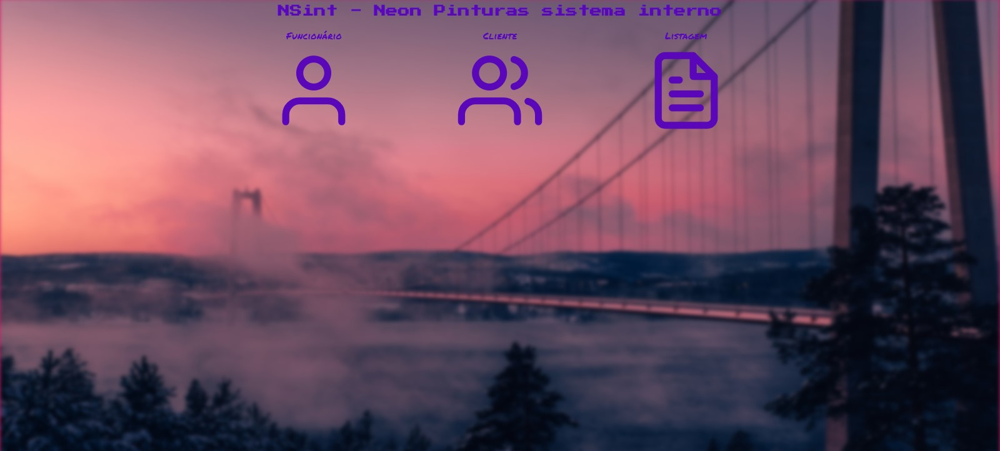

# <div align="center"> Nsint </div>

#### <div align="right">- Projeto em andamento <div>

### <div align="center"> Conteúdo de criação própria abordando conceitos sobre: </div>

 - HTML | CSS | Javascript
 - DOM - Data Object Model
 - ExpressJS
 - SQL
 - Nunjucks: Template engine
 - DDD - domain driven design

## <div align="center"> Sumário </div>
<!--ts-->
   - [Requisitos](#<div-align="center">Requisitos</div>)
   - [Tecnologias utilizadas](#<div-align="center">Tecnologias-utilizadas</div>)
   - [Autor](#<div-align="center">Autor</div>)
<!--te-->
## <div align="center">Requisitos</div>
Para executar a aplicação é necessário instalar algumas ferramentas tais como um editor de códigos para realizar compilação dos mesmos. Nesse projeto foi utilizado o [Visual Studio Code](https://code.visualstudio.com/), [NodeJS](https://nodejs.org/en/) para compilação do código, [Git Bash](https://gitforwindows.org/) para baixar o repositório e baixar todas as dependências necessárias. Além do mais, é necessário instalar o [plugin sqlite na seção de plugin do Vscode](https://marketplace.visualstudio.com/items?itemName=alexcvzz.vscode-sqlite).


```bash
# Baixe o repositório.
$ git clone https://github.com/Ricnaga/NSint.git

# Acesse a pasta do projeto.
$ cd NSint

# Agora que baixou e acessou o repositório, vamos começar a instalação das dependências.
$ yarn ( caso não utilize o yarn execute apenas npm -i)

# Depois de instalado todas as dependências, abra a aplicação via vscode
$ code .

# Agore execute a aplicação.
$ yarn dev (caso não utilize o yarn: npm run dev)

# A aplicação iniciará na porta 3000
# No navegador digite: http://localhost:3000
```

##  <div align="center">Tecnologias utilizadas</div>
- [HTML](https://www.w3.org/HTML)
- [CSS](https://www.w3.org/Style/CSS/)
- [Javacript](https://developer.mozilla.org/en-US/docs/Web/JavaScript)
- [D.O.M.](https://dom.spec.whatwg.org/#what)
- [NodeJS](https://nodejs.org/en/)
- [Express](https://expressjs.com/pt-br/starter/installing.html)
- [Nunjucks](https://mozilla.github.io/nunjucks/)
- [Sqlite](https://www.nodenpm.com/sqlite-async/package.html)

## <div align="center">Autor</div>
<div align="center">Atividade de criação própria, gostou? tem alguma sugestão de melhoria? por favor, entre em contato e ja aproveita e me adiciona.<br>
<a href="https://www.linkedin.com/in/ricardo-nagatomy-56553254"></a>
<a href="https://app.rocketseat.com.br/me/ricardo-nagatomy-08130"></a>
</div>

